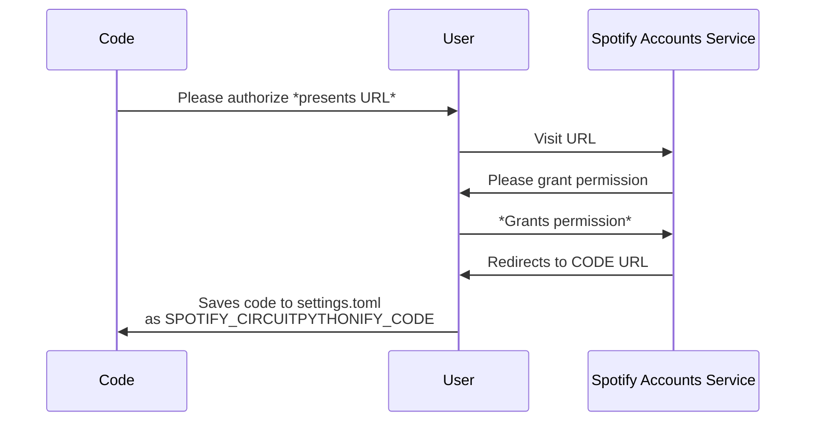
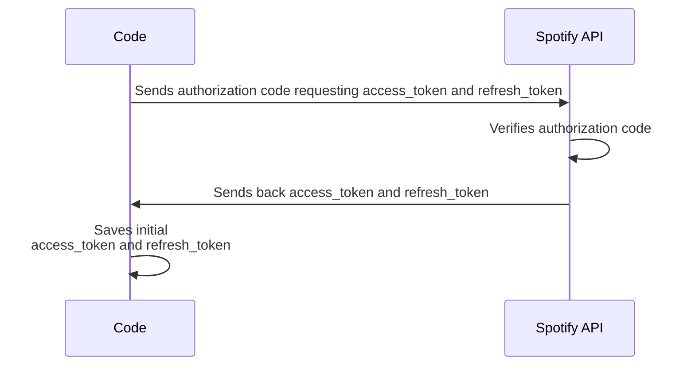

# CircuitSpotify
## Requirements
  * nvm support ( https://docs.circuitpython.org/en/latest/shared-bindings/nvm/index.html )
  * a session with internet connection (and thus a board that has networking capabilities)
  * CircuitPython Version 8.2.1 
    * (Do not use 8.2.2, 8.2.3 or 8.2.4, they have an incomplete certificate 
      list which will cause https connection problems)
## Initial setup steps
1. Download CircuitSpotify to your boards /lib/ directory
2. https://developer.spotify.com/ <br>
   Make and/or log in to an account 
3. https://developer.spotify.com/dashboard <br>
   Create an app
4. Copy the following data from the Basic Information dashboard page 
   of your app to your boards `settings.toml` file: 
	 ```
	CIRCUITSPOTIFY_CLIENT_ID = "Your Client ID"
	CIRCUITSPOTIFY_CLIENT_SECRET = "Your client secret"
	CIRCUITSPOTIFY_REDIRECT_URL = "Redirect URL"
	```
	*The redirect URL can be anything just make sure its URL encoded and matches 
	your Basic Information page settings. I used: https://open.spotify.com/ 
	(`CIRCUITSPOTIFY_REDIRECT_URL = "https%3A%2F%2Fopen.spotify.com%2F"`)*
5. Use your spotify account to authorize the apps required access.
Simply initializing this class after step 4 should make it print a url.
Visit this URL, grant the authorization and you'll be redirected to the
redirect_url you have set up for your app.
What is important is the code in the URL after ?code=
Copy this and paste it into settings.toml as `CIRCUITSPOTIFY_CODE`

That should be it, you have created and authorized the app on Spotify's side of things.
The code should now be able to receive a request and access token.

**NOTE**:
>With some luck you'll only have to do these steps once. However this class might
print the authorization URL once again if some kind of problem occurs in which
case you will have to repeat step 5.

### Example code
If you've walked through the steps above or at least got to step 5 you might want to use this example to get you started:
```python
import os
import ssl
import wifi
import socketpool
import adafruit_requests
import time
from circuitspotify import CircuitSpotify

print()
print("Connecting to WiFi...")
#  connect to your SSID
wifi.radio.connect(
    # Make sure these are set in settings.toml
    os.getenv('CIRCUITPY_WIFI_SSID'), # WiFi identifier (name)
    os.getenv('CIRCUITPY_WIFI_PASSWORD') # WiFi password
)
print(f"Connected to SSID {os.getenv('CIRCUITPY_WIFI_SSID')}")

# Set up a session with the socket pool
POOL = socketpool.SocketPool(wifi.radio)
SESSION = adafruit_requests.Session(POOL, ssl_context=ssl.create_default_context())

circuitSpotify = CircuitSpotify(SESSION, [
    CircuitSpotify.Scope.USER_READ_CURRENTLY_PLAYING
], print_everything = False)


while True:
    data = circuitSpotify.get_currently_playing()

    if 'item' in data:
        track_name = data['item']['name']
        release_date = data['item']['album']['release_date']
        artist_names = [artist['name'] for artist in data['item']['artists']]

        print(f'[{release_date[:4]}] {" & ".join(artist_names)} - {track_name}')
    else:
        print(dict)

    # Spotify isn't very clear on how many requests you're allowed to send 
    # But according a community post it's about 180 per minute so avoid
    # a value lower than 0.33 down below.
    time.sleep(1) 
```

## Token (work)flow
The initial setup should have enabled the CircuitPythonify class took care of these steps:

That means the code is now able to get the **very** important access_token, and a refresh_token to go along with it.

With an access token the spotify servers can be queried for information which it will give in the JSON format.  Once the access_token expires (after 1 hour) the access_token expires and a new one will have to be requested. 
The idea of this class is that it tries to handle all of this logic silently. You do the setup and (hopefully) the code does the rest. 
Just keep hitting the currently playing method and it will just keep giving the information.

Requesting, saving and refreshing tokens is all handled internally by the class.

``` mermaid
sequenceDiagram
loop Every time_interval
	Code->>Spotify API: Here's my access_token please send me the info
	Spotify API->>Spotify API: Verifies access_token
	rect  rgb(19, 21, 23)
	Note over Code, Spotify API: Optional path if access_token is expired
	Spotify API-->>Code: Your access_token expired
	Code-->>Spotify API: Whoops, can I have a new one? Here's my refresh_token
	Spotify API-->>Spotify API: Verifies refresh_token
	Note over Spotify API: When this fails it's time <br> to start from the very start<br> and get a new code
	Spotify API-->>Code: Refresh_token_checks out, have a new_access_token
	Code-->>Code: Start from the top
	Note over Code, Spotify API: End of optional path 
	end
	Spotify API->>Code: Here's the info
end
```


## Open to contributions
I could not find any examples of connecting to Spotify in CircuitPython, 
for my own purposes I only need access to the currently playing song. 

However I am open to contributions to expand upon this class and get it to do all things 
Spotify - which is why the internal class Scope (CircuitSpotify.Scope) contains
all the possible scopes. I'm hoping this class can serve as a starting point for others
and that together we can turn it into something that saves others a lot of hassle and time :)

## License
MIT Licensed


